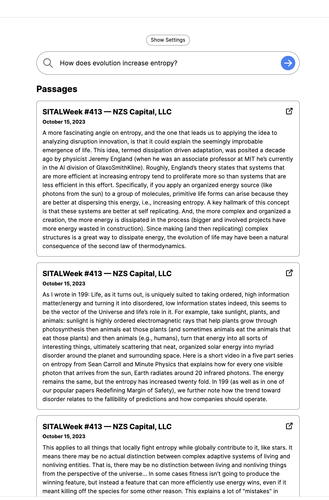
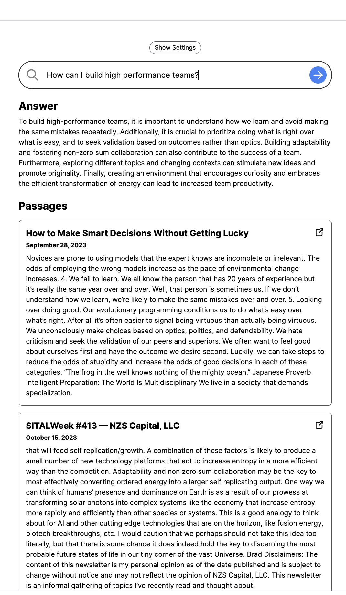
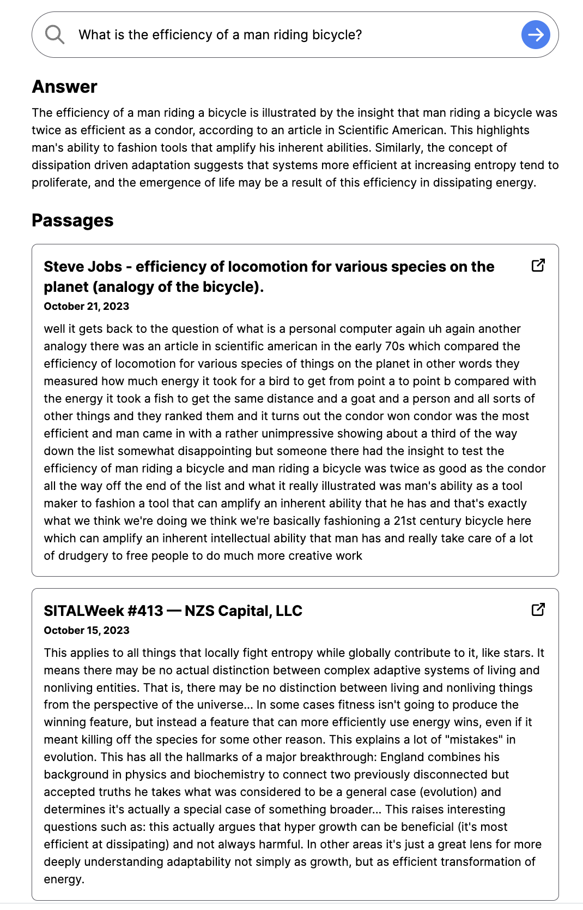

# My Memory Palace

AI-powered search, chat, and graph exploration for my memory palace.

This repo now runs as a plain local Next.js app.

## Dataset

Search reads from `data/memory-palace-ingested.json`, which is built from the local `memory_palace/` directory.

If the ingested file is missing, `npm run server:start` will generate it automatically by running `npm run ingest-memory-palace`.

The landing-page graph reads from the sibling Obsidian vault in `../LLM_QA_Bot/vault`.

## How It Works

My Memory Palace provides 2 things:

1. A search interface.
2. A chat interface.
3. A vault-backed discovery graph with generated example prompts.

### Search

Search is local. The app tokenizes the query, scores matching passages from the ingested memory file, and returns the highest-ranked chunks.

### Chat

Chat builds on top of search. It uses the retrieved passages to build a prompt for the configured LiteLLM gateway and falls back to a local passage synthesis if the model is unavailable.

### Discovery

The landing page also loads a curated graph from the sibling vault and requests cluster-specific example prompts from LiteLLM.

If LiteLLM is unavailable, the app serves cached prompts or deterministic local fallbacks so the page stays usable.

# Examples

Search Example:


Chat Example:


Another Chat Example:


## Running Locally

This is the minimal local workflow.

### Requirements

1. Install dependencies
2. Provide LiteLLM env vars for your local gateway
3. Keep your local memory source data in `memory_palace/`
4. Keep `../LLM_QA_Bot/vault` available if you want the graph explorer

### Repo Setup

1. Install dependencies

```bash
npm i
```

2. Create `.env.local`

```bash
LITELLM_BASE_URL=http://localhost:4000
LITELLM_API_KEY=
LITELLM_MODEL=gemini-3-flash-preview
LITELLM_EMBEDDING_MODEL=text-embedding-3-large
```

3. Start the local app server

```bash
npm run server:start
```

4. Check status or stop it later

```bash
npm run server:status
npm run server:stop
```

### Notes

- The server runs on `http://localhost:3001`.
- Logs are written to `.runtime/memorypalace-server.log`.
- The PID file is `.runtime/memorypalace-server.pid`.
- Discovery prompt cache is written to `.runtime/discovery-cache.json`.
- If you want to rebuild the searchable dataset manually, run `npm run ingest-memory-palace`.

## Credits

This is a project forked from https://github.com/mckaywrigley/paul-graham-gpt
