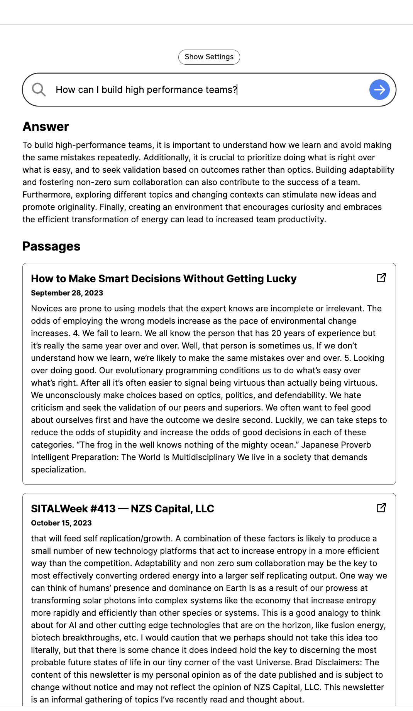

# My Memory Palace

AI-powered search and chat for my memory palace.

All code & data used is 100% open-source.

## Dataset

The dataset comes from supabase database where I store my embeddings from the articles/videos/pdfs I consume.
Here is the repo for the LLM Bot: https://github.com/dino1729/LLM_QA_Bot
## How It Works

My Memory Palace provides 2 things:

1. A search interface.
2. A chat interface.

### Search

Search was created with [OpenAI Embeddings](https://platform.openai.com/docs/guides/embeddings) (`text-embedding-ada-002`).

In the app we take the user's search query, generate an embedding, and use the result to find the most similar chunks from my memory palace.

The comparison is done using cosine similarity across our database of vectors.

Our database is a Postgres database with the [pgvector](https://github.com/pgvector/pgvector) extension hosted on [Supabase](https://supabase.com/).

Results are ranked by similarity score and returned to the user.

### Chat

Chat builds on top of search. It uses search results to create a prompt that is fed into GPT-3.5-turbo-16k.

This allows for a chat-like experience where the user can ask questions about the book and get answers.

# Examples

Search Example:


Chat Example:


Another Chat Example:


## Running Locally

Here's a quick overview of how to run it locally.

### Requirements

1. Set up OpenAI

You'll need an OpenAI API key to generate embeddings.

2. Set up Supabase and create a database and check the memorize box in the LLM QA Bot app to upload the embeddings to the memory palace database.

### Repo Setup

3. Clone repo

```bash
git clone https://github.com/mckaywrigley/paul-graham-gpt.git
```

4. Install dependencies

```bash
npm i
```

5. Set up environment variables

Create a .env.local file in the root of the repo with the following variables:

```bash
OPENAI_API_KEY=

NEXT_PUBLIC_SUPABASE_URL=
SUPABASE_SERVICE_ROLE_KEY=
```

### App

8. Run app

```bash
npm run dev
```

### Docker Build

```bash
docker build -t mymemorypalace .
docker run -p 3001:3001 --env-file .env.local --restart always --name mymemorypalace-container mymemorypalace
```

## Credits

This is a project forked from https://github.com/mckaywrigley/paul-graham-gpt
